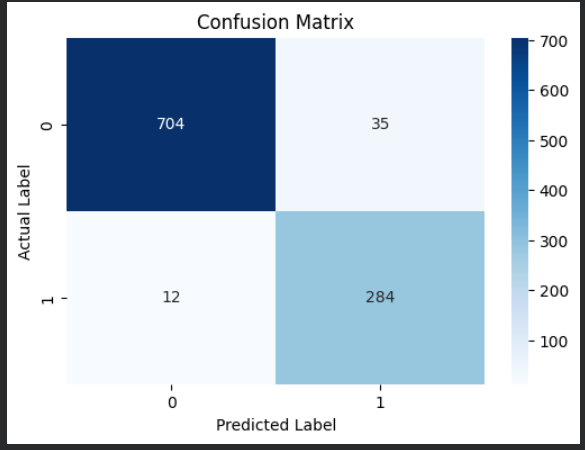

# Email Spam Detection using Machine Learning

This project builds a machine learning model that detects whether an email is spam or ham.

## Algorithm
Multinomial Naive Bayes

## Tools
Python
Pandas
Scikit-learn
Matplotlib

## Accuracy
95%

## Project Workflow
1. Load dataset
2. Data preprocessing
3. Train ML model
4. Evaluate using confusion matrix
5. Test with real email text

## Example
Input: "Congratulations! You won a lottery"

Output: Spam Email
## Model Performance

